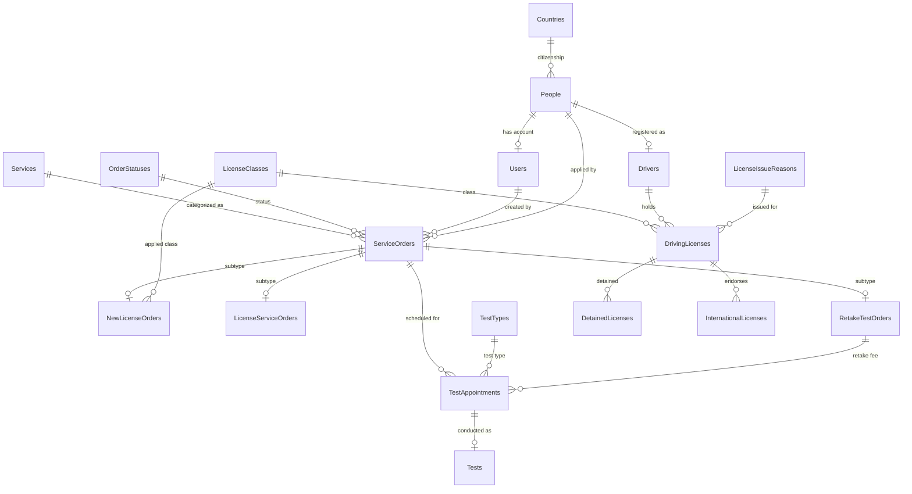

# LicenseHub (DVLD)

**LicenseHub** is a comprehensive Driving & Vehicle License Department (**DVLD**) management system designed to streamline, automate, and manage the full lifecycle of driving licenses, testing procedures, driver records, and administrative workflows.

---

## 📌 Project Overview

LicenseHub regulates and tracks all core operations for issuing and managing driving licenses in compliance with official traffic authority standards:

- **People & Identity Management:** Unique identification via National IDs, full 4-part personal records, and nationality mapping.
- **Role-Based User Management & Security:** Secure user authentication, granular bitwise permissions, and user activation states.
- **Application & Service Orders:** Generic application foundation (`ServiceOrders`) utilizing Table-Per-Type (TPT) inheritance for specialized services (First-Time License, Retake Tests, Renewals, Replacements).
- **Multi-Stage Testing Pipeline:** Strict 3-step sequential testing (Vision $\rightarrow$ Theory / Written $\rightarrow$ Practical / Street) with appointment scheduling, fee snapshots, appointment locking, and examiner record tracking.
- **Driving License Issuance & Classes:** Support for 7 distinct license classes with age, validity, and fee rules.
- **License Lifecycle Services:** Renewals, replacements for lost or damaged licenses, and official driver conversion upon first license issuance.
- **Detention & Release Management:** Complete audit trail for detaining suspended/confiscated licenses (tracking detention reasons, fines, and release fees).
- **International Driving Licenses:** Issuance and validation of international licenses governed by Class 3 local licenses.

---

## 🗄️ Database Architecture

The system is backed by a fully normalized relational database design modeled in [`ProjectDesign.drawio`](ProjectDesign.drawio).

### Table Breakdown (18 Tables)

| Category | Table Name | Purpose |
| :--- | :--- | :--- |
| **Identity & Users** | `People` | Master personal profiles (National ID, 4-part name, DOB, Gender, Address, Phone, Email, Photo). |
| | `Countries` | Lookup table for nationalities and country codes. |
| | `Users` | System operator accounts with hashed passwords, active states, and permission masks. |
| | `Drivers` | Official driver entity created once upon obtaining the first driving license. |
| **Applications** | `Services` | Catalog of department services and base application fees. |
| | `OrderStatuses` | Application lifecycle statuses (`New`, `Cancelled`, `Completed`). |
| | `ServiceOrders` | Base application transaction logging fees, dates, applicant, and audit user. |
| | `NewLicenseOrders` | Application subtype for first-time driving licenses (captures requested `LicenseClassID`). |
| | `LicenseServiceOrders`| Application subtype for renewals and replacements (captures `OldLicenseID`). |
| | `RetakeTestOrders` | Application subtype for scheduling test retakes (captures `PreviousAppointmentID`). |
| **Testing Pipeline** | `TestTypes` | Configurable definitions for Vision, Written (Theory), and Practical tests. |
| | `TestAppointments` | Scheduled exam slots with fee snapshots, `IsLocked` state, and optional `RetakeTestOrderID`. |
| | `Tests` | Exam execution results (`TestResult`, examiner `Notes`, `TestDate`, `CreatedBy`). |
| **Licensing** | `LicenseClasses` | The 7 official license classes, minimum ages, validities, and class fees. |
| | `LicenseIssueReasons`| Lookup table for license issuance reasons (First Time, Renew, Replacement for Lost/Damaged). |
| | `DrivingLicenses` | Issued local driving licenses tracking issue/expiration dates, status (`IsActive`), and driver link. |
| | `DetainedLicenses` | Confiscated licenses tracking `DetainReason`, `FineFees`, release status, and release order link. |
| | `InternationalLicenses`| International driving permits issued to holders of valid Class 3 local licenses. |

---

## 🛠️ Key Architectural Patterns

1. **Table-Per-Type (TPT) Subtyping:**
   - Special service applications share a common primary key (`OrderID`) with `ServiceOrders`, eliminating sparse columns while preserving referential integrity.
2. **Appointment Locking & State Protection:**
   - Appointments in `TestAppointments` are locked (`IsLocked = 1`) immediately after test execution in `Tests`, preventing double-booking or retroactively changing historical exam records.
3. **Comprehensive Audit Trail:**
   - In adherence to system requirements, all critical actions (order submission, appointment booking, exam evaluation, detention, and license issuance) record `CreatedBy` (linked to `Users`) and corresponding timestamps.
4. **Historical Price Stability:**
   - Whenever an order or appointment is generated, fees are snapshotted into `OrderFee` and `TestFee`, protecting past transaction records from future administrative price updates.

---

## 🚀 Getting Started & Roadmap

1. **Database Scripting:** Generate DDL schema scripts (`CREATE TABLE`, constraints, indexes, foreign keys) from `ProjectDesign.drawio`.
2. **Data Access Layer (DAL):** Implement repository and database helper patterns (CRUD stored procedures and ADO.NET / Dapper / EF Core queries).
3. **Business Logic Layer (BLL):** Implement business rules (age validation, test prerequisites, detention checks, license expiration calculations).
4. **Presentation Layer (UI):** Build user interfaces for desktop (Windows Forms / WPF) or modern web.